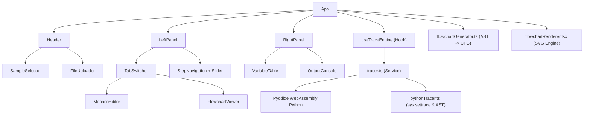

# TraceApp (PyTrace) — 基本設計書

## 1. プロジェクト概要

**目的**: プログラミング教育用の Python トレース・流れ図可視化ツール。学生や初学者がプログラムの実行順序や変数の値の変化、アルゴリズムの構造を視覚的・段階的に理解できる Web アプリケーション。

**ターゲットユーザー**: プログラミング初学者、学生、情報教育の指導者

**技術スタック**: Vite + React + TypeScript、Pyodide（WebAssembly 版 Python）、Monaco Editor、Vanilla CSS、Lucide Icons

**動作環境**: Web ブラウザ完結（単一ポータブル HTML による完全オフライン動作対応）

---

## 2. 画面構成

### 2.1 全体レイアウト

```
┌─────────────────────────────────────────────────────────────────┐
│  ヘッダー（アプリ名 + サンプル選択ドロップダウン + ファイル読込）  │
├───────────────────────────────┬─────────────────────────────────┤
│                               │                                 │
│   左パネル                     │   右パネル                       │
│   ┌─────────────────────────┐ │   ┌───────────────────────────┐ │
│   │ [コード] [流れ図] タブ    │ │   │  変数履歴表（スプレッド     │ │
│   ├─────────────────────────┤ │   │  シート型）                 │ │
│   │                         │ │   │                             │ │
│   │  コードエディタ          │ │   │  x  |  y  | total           │ │
│   │  または                  │ │   │ ----+-----+-----           │ │
│   │  流れ図表示              │ │   │  5  |  -  |  -             │ │
│   │                         │ │   │  5  |  3  |  -             │ │
│   │  (実行行ハイライト付き)   │ │   │  5  |  3  |  8             │ │
│   │                         │ │   │                             │ │
│   └─────────────────────────┘ │   ├───────────────────────────┤ │
│                               │   │  print出力エリア            │ │
│   ┌─────────────────────────┐ │   │  > Hello World             │ │
│   │ [最初] [前へ] [次へ] [最後] │   │  > 合計: 8                 │ │
│   │ ◄━━━━━━━●━━━━━━━━━► スラ│ │   └───────────────────────────┘ │
│   │  イダー (ステップ位置)     │ │                                 │
│   └─────────────────────────┘ │                                 │
└───────────────────────────────┴─────────────────────────────────┘
```

### 2.2 左パネル — コード(Python) / コード(マクロ言語) / 流れ図表示
- **タブ切り替え**: 「コード(Python)」「コード(マクロ言語)」「流れ図」を瞬時に切り替え（ステップ状態・ズーム率は保持）。
- **コード(Python)タブ**:
  - **Monaco Editor**（Python シンタックスハイライト、直接編集、.py ファイル読込）。
  - 実行行のリアルタイム・デコレーションハイライト。
  - 「マクロ言語へ変換 ➔」ボタンによる VBA へのワンクリック変換。
- **コード(マクロ言語)タブ**:
  - **Monaco Editor**（VBA シンタックスハイライト、全構文キーワードの青色表示、直接編集）。
  - Python トレース実行行と連動したリアルタイム・デコレーションハイライト。
  - 「⬅ Pythonへ変換」ボタンによる Python への逆変換。
- **流れ図タブ**:
  - Python AST から自動生成された標準流れ図（SVG 独自レンダリング）。
  - 現在実行中のノードの自動ハイライト。
  - ズームスライダー（50% 〜 400%）による拡大縮小表示。
- **ナビゲーションコントロール**:
  - 「最初」「前へ」「次へ」「最後」「リセット」ボタン。
  - **ステップスライダー**: 全ステップ中の現在位置を可視化し、ドラッグで任意ステップへジャンプ可能。

### 2.3 右パネル — 変数履歴 + print 出力
- **変数履歴表（上部）**:
  - スプレッドシート型（横: 変数名、縦: 各ステップの推移）。
  - 値が更新されたセルおよび列全体をハイライト。
  - **「変更のない行を非表示」フィルター**: 値が変化したステップのみに絞り込み可能。
  - 原則グローバル変数扱い、関数呼び出し時のみローカル変数を区別表示。
- **print 出力エリア（下部）**:
  - ステップ進行に応じた標準出力（stdout）の段階的キャプチャ表示。
- **ドラッグリサイザー**:
  - 左右パネル間の水平リサイズ、および右パネル内の上下リサイズに対応。

---

## 3. アーキテクチャ

### 3.1 コンポーネント構成図



> [!NOTE]
> 単一 HTML ファイル（`dist/index.html`）での完全オフライン動作およびブラウザ互換性を最大化するため、Pyodide はメインスレッド上の単一インスタンスとして直接インメモリ実行されます。

---

## 4. 核心ロジック — トレースエンジン

### 4.1 ステップ実行の仕組み
1. **全ステップ事前実行方式**:
   - コード実行開始時、Pyodide 上で `sys.settrace()` を用いてプログラム全体を一括事前実行。
   - 各ステップの状態（行番号、変数のスナップショット、累積 print 出力）を `StepSnapshot[]` 配列として保持。
   - ナビゲーション時はインデックスの移動のみでゼロ遅延でステップ遷移を実現。
2. **安全ガード機構**:
   - **無限ループ防止**: 10,000 ステップ超過時に `TraceLimitExceeded(BaseException)` を送出し安全停止。
   - **例外安全捕捉**: 構文エラー（`SyntaxError`）や実行時例外（`ZeroDivisionError` 等）をクラッシュさせずに捕捉し、UI に分かりやすく通知。
   - **特殊値サニタイズ**: `NaN`, `Infinity`, 循環参照オブジェクトを JS 互換文字列表現にサニタイズ。

---

## 5. Python → 流れ図変換・描画仕様

### 5.1 記号と表記仕様

| 構文 | 流れ図記号 | 形状 | 表記規則 |
|---|---|---|---|
| 代入文 (`a = 5`) | 処理 | 長方形 | `5 → a` |
| 累加代入 (`a += 2`) | 処理 | 長方形 | `a ＋ 2 → a`（四則演算・べき乗・剰余を展開） |
| 条件分岐 (`if` / `elif`) | 判断 | ひし形 | 数学記号化（`==` → `＝`, `!=` → `≠`, `>=` → `≧` 等） |
| 条件分岐 (`else:`) | 分岐先 | 長方形（先頭） | No 側に整列配置 |
| 繰り返し (`while` / `for`) | ループ開始/終了 | 六角形 | `for i in range(1, 4)` → `ループ\niを1から3まで1ずつ増やしながら` |
| 関数定義 (`def`) | 端子 / サブルーチン | 角丸長方形 / 二重線長方形 | 関数開始・終了端子、呼び出しブロック |
| 開始 / 終了 | 端子 | 角丸長方形 | `開始` / `終了` |

### 5.2 レイアウトとアノテーション仕様
- **if / elif / else 多分岐**:
  - 先頭ノードは横並び、2つ目以降のブロックは隙間なく縦配置。
  - すべての分岐から戻る線を**同一の高さ（共通水平合流線）**で 1 箇所に合流。
- **行末コメントのアノテーション表示**:
  - 命令行末尾の `# (ア)` などのコメントを抽出し、ブロック右横（条件分岐は右下）に 14px スレートグレーで描画。
  - **分岐スコープ対応**: 分岐外（合流後など）のコメントによって分岐ブロックの X 座標が押し出されないよう、Y 方向で重なるノードのコメント幅のみを参照してカラム間隔を自動計算。
- **単語途中改行の防止（トークン単位改行）**:
  - 識別子・数値・演算子・空白のトークン単位で改行位置を決定し、変数名が途中で分断されるのを防止。

---

## 6. プリセット学習プログラム

1. **1. 基本的な順次・代入**: 基本代入と四則演算、計算結果出力
2. **2. 条件分岐**: if / elif / else 多分岐
3. **3. ループと関数**: def 関数定義と for ループ累積
4. **4. print 出力テスト**: 段階的な標準出力テスト
5. **２級 第73回【４】(１)(２)**: 全商情報処理検定 ２級 第73回【４】トレース演習
6. **２級 第73回【４】(３)(４)**: 全商情報処理検定 ２級 第73回【４】初期値変更演習
7. **２級 第74回【４】(１)(２)**: 全商情報処理検定 ２級 第74回【４】トレース演習
8. **２級 第74回【４】(３)(４)**: 全商情報処理検定 ２級 第74回【４】初期値変更演習
